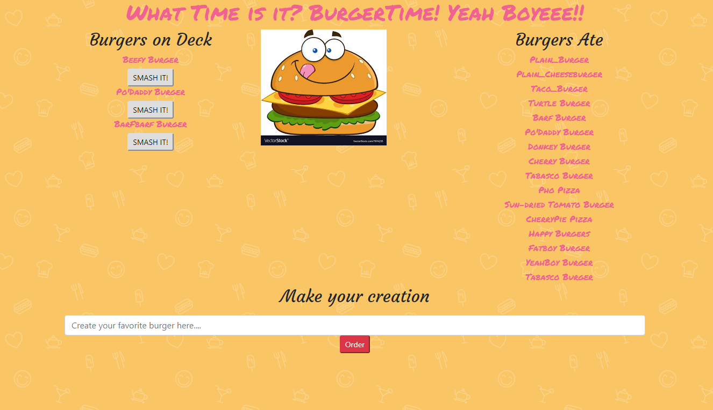
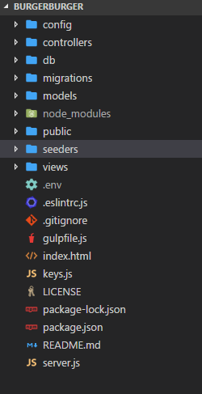

# ProPublica Scrapper    
 This app uses Axios a browser based HTTP client to access
 content upon ProPublica's webpage. This content is then
 manipulated and displayed to the user.

## Problem solved
1. How to access different content across a variety of sites
  without actually having to physically visit each site.
2. How to store data without creating redundant enteries.
3. How do we allow the user to attach comments/likes to data.

## Deployed Site

[Deployed App](https://sleepy-dawn-98220.herokuapp.com/)

# Tools
- Node.js
- Express.js
- JQUERY
- HandleBars.js
- Heroku
- GitHub
- Nodemon.js
- DocToc (Table of Contents)
- Bootstrap
- MySQL

<!-- START doctoc generated TOC please keep comment here to allow auto update -->
<!-- DON'T EDIT THIS SECTION, INSTEAD RE-RUN doctoc TO UPDATE -->
**Table of Contents**  *generated with [DocToc](https://github.com/thlorenz/doctoc)*
- [Frontend](#Frontend)
 - [Bootstrap](https://getbootstrap.com/docs/4.0/getting-started/introduction/)
 - [JQUERY](https://jquery.com/)

- [Backend](#Backend)
 - [Node.js](https://nodejs.org/en/)
 - [MySQL](https://www.mysql.com/)
 - [Express.js](https://expressjs.com/)
 - [Nodemon](https://www.npmjs.com/package/nodemon)
 - [Express-Handlebars.js](https://www.npmjs.com/package/express-handlebars)

- [Development Tools](#development-tools)
 - [Heroku](https://www.heroku.com/)
 - [GitHub](https://github.com/JasonRobnson/BurgerBurger)
 - [DocToc](https://github.com/thlorenz/doctoc)

<!-- END doctoc generated TOC please keep comment here to allow auto update -->

### Required File Structure

### commands

- `nodemon server.js || node server.js`: will get the app up and running after all dependencies are installed.

## Database
[MySQL](https://www.mysql.com/) is used as the database for this project. 

